# Uncle-Ali-Tours

## Motivation

The **Trip Advising Website** was developed as part of the **Advanced Computing Lab (ACL)** course (Code: CSEN704) at the German University in Cairo. This project was inspired by the growing need for efficient and personalized trip planning tools in today's fast-paced world.

Travelers often face challenges in finding trustworthy information, comparing options, and making decisions that fit their preferences and budget. Our project addresses this gap by providing a user-friendly platform that offers recommendations, reviews, and detailed information to simplify the trip planning process.

From an academic perspective, this project serves as an opportunity to apply and integrate knowledge from various domains, including web development, databases, and user experience design. It also demonstrates collaborative skills and best practices in software engineering, such as version control and agile development, while solving a real-world problem.

## Code Style

The project adheres to clean and consistent coding practices tailored to the MERN stack, with **Tailwind CSS** for styling. Below are the key aspects of the code style:

### General

- **Languages Used**:

  - Frontend: React.js (JavaScript/JSX).
  - Backend: Node.js with Express.js.
  - Database: MongoDB with Mongoose.
  - Styling: Tailwind CSS.
- **Formatting**:

  - Indentation: 2 spaces (default for JavaScript/React).
  - Line Length: Maximum of 100 characters for better readability.
  - File Naming:
    - React components: `PascalCase` (e.g., `TripAdvisorCard.js`).
    - Utility functions and hooks: `camelCase` (e.g., `useFetchData.js`).

### Frontend (React.js and Tailwind CSS)

- **Components**:

  - Functional components using hooks (`useState`, `useEffect`, etc.).
  - Components are modular and reusable.
- **Styling with Tailwind CSS**:

  - Use semantic class names provided by Tailwind for styling.
  - Component-specific styles are grouped logically for maintainability.
  - Utility-first approach for rapid UI development.
- **State Management**:

  - Local state managed with React hooks.
  - Global state handled using Context API or a state management library (e.g., Redux).
- **Coding Practices**:

  - Follow **ESLint** with Airbnb configuration for linting.
  - Use **Prettier** for auto-formatting.

### Backend (Node.js and Express.js)

- **API Design**:

  - RESTful APIs with meaningful endpoint names (e.g., `/api/trips` or `/api/users`).
  - Use **Express Router** for modular routes.
- **Middleware**:

  - Separate middleware for authentication, validation, and error handling.
- **Error Handling**:

  - Centralized error handling using `try...catch` blocks and custom error classes.
- **Environment Variables**:

  - Sensitive information (e.g., database URIs, API keys) is stored in a `.env` file and accessed using `dotenv`.

### Database (MongoDB with Mongoose)

- **Schema Design**:

  - Schemas are modular and placed in the `models` directory.
  - Use appropriate data validation and constraints in Mongoose schemas.
- **Queries**:

  - Avoid embedding large documents; use references where appropriate.
  - Use indexes for frequently queried fields.

### Version Control

- **Branching Strategy**:

  - All work was done directly on the `main` branch.
  - While feature branches were not utilized, commit messages were structured to ensure clarity and traceability.
- **Commit Messages**:

  - Followed the [Conventional Commits](https://www.conventionalcommits.org/) specification:
    - `feat`: New feature (e.g., `feat: add trip search functionality`).
    - `fix`: Bug fix (e.g., `fix: resolve crash on login`).
    - `refactor`: Code improvements without changing behavior.
    - `docs`: Documentation updates.

### Tools Used

- **Styling**: Tailwind CSS for utility-first design.
- **Linting**: ESLint (Airbnb Style Guide).
- **Formatting**: Prettier.
- **Version Control**: Git with all development on the `main` branch.

By following these conventions, the project maintains consistency, even when all work is centralized on a single branch.

## Build Status

The project is currently in a stable state with all major features implemented and tested. Continuous Integration (CI) and Continuous Deployment (CD) pipelines are set up to ensure the build remains stable.

If there are any issues not mentioned here, please report them by opening an issue on the GitHub repository.

## Features

- **Trip Booking and Management**: Users can browse, book, and manage their trips, including itineraries and activities.
- **Product Purchase and Wishlist**: Users can purchase products, add items to their wishlist, and manage their shopping cart.
- **Viewing and Managing Itineraries and Activities**: Users can view upcoming and past itineraries and activities, and manage their bookings.
- **User Preferences and Recommendations**: Personalized recommendations based on user preferences and past activities.
- **Complaints and Feedback**: Users can submit complaints and feedback to improve the service.
- **Responsive Design**: The application is fully responsive and works seamlessly on various devices.
- **Admin Dashboard**: Admins can manage users, trips, products, and view analytics.
- **Notifications**: Users receive notifications for booking confirmations, updates, and reminders.
- **Search and Filter**: Advanced search and filter options to help users find trips, activities, and products easily.

## Code Examples

### App Component

This file initializes user data and sets up different stores based on the user type.

```jsx
function App() {
  const { user, setUser } = useUserStore();
  const { getGuide } = useGuideStore();
  const { getSeller } = useSellerStore();
  const { tourist, getTourist } = useTouristStore();
  const { getAdvertiser } = useAdvertiserstore();
  const [loading, setLoading] = React.useState(false);

  useEffect(() => {
    const user = JSON.parse(localStorage.getItem("user"));
    if (user) {
      setLoading(true);
      setUser(user);
      switch (user.type) {
        case "tour guide":
          getGuide({ userName: user.userName }, {});
          break;
        case "advertiser":
          getAdvertiser({ userName: user.userName }, {});
          break;
        case "seller":
          getSeller({ userName: user.userName }, {});
          break;
        case "tourist":
          getTourist({ userName: user.userName }, {});
          break;
        default:
          break;
      }
    }
    setLoading(false);
  }, []);

  return (
    <div>
      <Navbar />
      
      {!loading ? (
        <Routes>
          <Route path="/security" element={<Security />} />
          {/* Other routes */}
        </Routes>
      ) : (
        <div>Loading...</div>
      )}
    </div>
  );
}
```

### CartComponent

This file initializes user data and sets up different stores based on the user type.

```jsx
const CartPage = ({ user }) => {
  const { cartProducts, getCartProducts, checkoutProducts, removeProductCart } = useTouristStore();
  const navigate = useNavigate();

  useEffect(() => {
    getCartProducts(user.userName);
  }, [user.userName, cartProducts]);

  const handleCheckout = () => {
    if (cartProducts.length === 0) {
      alert("Your cart is empty. Please add some products before checking out.");
      return;
    }
    checkoutProducts();
    navigate(`/payment/product/id`);
  };

  const handleRemove = (productId) => {
    removeProductCart(user.userName, productId);
  };

  return (
    <div className="Cart-page">
      {/* Back Arrow */}
      <button onClick={() => navigate(-1)} className="text-blue-500 hover:underline mb-4 flex items-center">
        {/* SVG for back arrow */}
      </button>
      {/* Display Cart products */}
      {cartProducts.length > 0 ? (
        <div>
          <div className="grid grid-cols-1 md:grid-cols-3 gap-4">
            {cartProducts.map((product) => (
              <div key={product.productId._id} className="product-card p-4 border rounded shadow">
                <h2 className="text-xl font-semibold">{product.productId.name}</h2>
                <p>{product.productId.description}</p>
                <p className="text-gray-500">Price: ${product.productId.price}</p>
                <p className="text-gray-500">Quantity: {product.quantity}</p>
                <button
                  className="mt-2 bg-red-500 text-white py-1 px-4 rounded hover:bg-red-600"
                  onClick={() => handleRemove(product.productId._id)}
                >
                  Remove
                </button>
              </div>
            ))}
          </div>
          {/* Checkout button */}
          <button className="mt-4 bg-green-500 text-white py-2 px-4 rounded hover:bg-green-600" onClick={handleCheckout}>
            Checkout
          </button>
        </div>
      ) : (
        <p>Your cart is empty.</p>
      )}
    </div>
  );
};
```

### Payment Controller

This file initializes user data and sets up different stores based on the user type.

```jsx
export const handlePayment = async (req, res) => {
  const { userName, items, amountPaid, type } = req.body;
  try {
    const tourist = await Tourist.findOne({ userName });
    if (!tourist) {
      return res.status(404).json({ success: false, message: "Tourist not found" });
    }

    let value = 0;
    switch (tourist.badge) {
      case 'level 1':
        value = amountPaid * 0.5;
        break;
      case 'level 2':
        value = amountPaid * 1;
        break;
      case 'level 3':
        value = amountPaid * 1.5;
        break;
      default:
        return res.status(400).json({ success: false, message: "Invalid badge level" });
    }

    if (isNaN(value)) {
      return res.status(400).json({ success: false, message: "Calculated value is invalid" });
    }

    tourist.myPoints += value;

    switch (type) {
      case 'activity':
        await Promise.all(items.map(async (item) => {
          const activity = await Activity.findById(item.itemDetails._id);
          tourist.ActivityBookings.push(activity._id);
          activity.numberOfBookings++;
          await activity.save();
        }));
        break;
      case 'itinerary':
        await Promise.all(items.map(async (item) => {
          const itinerary = await Itinerary.findById(item.itemDetails._id);
          tourist.itineraryBookings.push(itinerary._id);
          itinerary.numberOfBookings++;
          itinerary.isBooked = true;
          await itinerary.save();
        }));
        break;
      case 'hotel':
        await Promise.all(items.map(async (item) => {
          const hotelData = { data: item.itemDetails, name: item.itemData.name, creator: tourist.userName };
          const hotelReq = { body: hotelData };
          await createHotelBooking(hotelReq, res);
        }));
        break;
      case 'flight':
        await Promise.all(items.map(async (item) => {
          const flightData = { data: item.itemDetails, creator: tourist.userName };
          const flightReq = { body: flightData };
          await createFlightBooking(flightReq, res);
        }));
        break;
      default:
        return res.status(400).json({ success: false, message: "Invalid booking type" });
    }

    await tourist.save();
    res.status(200).json({ success: true, message: "Payment processed successfully" });
  } catch (error) {
    console.error("Error processing payment:", error);
    res.status(500).json({ success: false, message: "Server error processing payment" });
  }
};function App() {
  const { user, setUser } = useUserStore();
  const { getGuide } = useGuideStore();
  const { getSeller } = useSellerStore();
  const { tourist, getTourist } = useTouristStore();
  const { getAdvertiser } = useAdvertiserstore();
  const [loading, setLoading] = React.useState(false);

  useEffect(() => {
    const user = JSON.parse(localStorage.getItem("user"));
    if (user) {
      setLoading(true);
      setUser(user);
      switch (user.type) {
        case "tour guide":
          getGuide({ userName: user.userName }, {});
          break;
        case "advertiser":
          getAdvertiser({ userName: user.userName }, {});
          break;
        case "seller":
          getSeller({ userName: user.userName }, {});
          break;
        case "tourist":
          getTourist({ userName: user.userName }, {});
          break;
        default:
          break;
      }
    }
    setLoading(false);
  }, []);

  return (
    <div>
      <Navbar />
      
      {!loading ? (
        <Routes>
          <Route path="/security" element={<Security />} />
          {/* Other routes */}
        </Routes>
      ) : (
        <div>Loading...</div>
      )}
    </div>
  );
}
```

## Installation

### Prerequisites

- Node.js
- npm or yarn
- MongoDB

### Setup

1. **Clone the repository:**

   ```sh
   git clone <repository-url>
   cd Uncle-Ali-Tours
   ```
2. **Install dependencies for both frontend and backend:**

```sh
npm install
cd frontend
npm install
cd ..
```

3. **Create a `.env` file in the root directory and add your environment variables:**

   MONGO_URI=`<your-mongodb-uri>`
   JWT_SECRET=`<your-jwt-secret>`
4. **Start the development server:**

   ```bash
   npm run app
   ```
5. **Open your browser and navigate to `http://localhost:5000`.**

## API References

### User Routes

- `POST /api/users/register` - Register a new user
- `POST /api/users/login` - Login a user
- `GET /api/users/profile` - Get user profile

### Trip Routes

- `GET /api/trips` - Get all trips
- `POST /api/trips` - Create a new trip
- `GET /api/trips/:id` - Get a specific trip

### Product Routes

- `GET /api/products` - Get all products
- `POST /api/products` - Add a new product
- `GET /api/products/:id` - Get a specific product

### Activity Routes

- `GET /api/activities` - Get all activities
- `POST /api/activities` - Create a new activity
- `GET /api/activities/:id` - Get a specific activity

### Itinerary Routes

- `GET /api/itineraries` - Get all itineraries
- `POST /api/itineraries` - Create a new itinerary
- `GET /api/itineraries/:id` - Get a specific itinerary

### Booking Routes

- `POST /api/bookings` - Create a new booking
- `GET /api/bookings/:id` - Get a specific booking
- `DELETE /api/bookings/:id` - Delete a specific booking

### Payment Routes

- `POST /api/payments` - Process a payment
- `GET /api/payments/:id` - Get a specific payment

### Wishlist Routes

- `GET /api/wishlist` - Get all wishlist items
- `POST /api/wishlist` - Add an item to the wishlist
- `DELETE /api/wishlist/:id` - Remove an item from the wishlist

### Cart Routes

- `GET /api/cart` - Get all cart items
- `POST /api/cart` - Add an item to the cart
- `DELETE /api/cart/:id` - Remove an item from the cart

### Complaint Routes

- `POST /api/complaints` - Submit a complaint
- `GET /api/complaints` - Get all complaints
- `GET /api/complaints/:id` - Get a specific complaint

### Admin Routes

- `GET /api/admin/users` - Get all users
- `DELETE /api/admin/users/:id` - Delete a specific user
- `GET /api/admin/trips` - Get all trips
- `DELETE /api/admin/trips/:id` - Delete a specific trip
- `GET /api/admin/products` - Get all products
- `DELETE /api/admin/products/:id` - Delete a specific product
- `GET /api/admin/activities` - Get all activities
- `DELETE /api/admin/activities/:id` - Delete a specific activity
- `GET /api/admin/itineraries` - Get all itineraries
- `DELETE /api/admin/itineraries/:id` - Delete a specific itinerary

## How to Use

1. Register or login to access the platform.
2. Browse and book trips, activities, and products.
3. Manage your bookings and preferences from your profile.

## Contribute

Contributions are welcome! Please open an issue or submit a pull request.

## Credits

This project was developed with the help of various online resources, including:

- [React Documentation](https://reactjs.org/docs/getting-started.html)
- [Node.js Documentation](https://nodejs.org/en/docs/)
- [MongoDB Documentation](https://docs.mongodb.com/)
- [Tailwind CSS Documentation](https://tailwindcss.com/docs)

## Tests

### Testing with Postman

You can use Postman to test the API endpoints. Below are some examples of how to test various routes:

#### User Registration

1. **Endpoint:** `POST /api/users/register`
2. **Request Body:**

   ```json
   {
     "userName": "testuser",
     "email": "testuser@example.com",
     "password": "password123",
     "type": "tourist"
   }
   ```
3. **Expected Response:**

   ```json
   {
     "success": true,
     "message": "User registered successfully"
   }
   ```

#### User Login

1. **Endpoint:** `POST /api/users/login`
2. **Request Body:**
   ```json
   {
     "email": "testuser@example.com",
     "password": "password123"
   }
   ```
3. **Expected Response:**
   ```json
   {
     "success": true,
     "token": "jwt-token"
   }
   ```

#### Get User Profile

1. **Endpoint:** `GET /api/users/profile`
2. **Headers:**
   - `Authorization`: `Bearer jwt-token`
3. **Expected Response:**
   ```json
   {
     "success": true,
     "data": {
       "userName": "testuser",
       "email": "testuser@example.com",
       "type": "tourist"
     }
   }
   ```

#### Create a Trip

1. **Endpoint:** `POST /api/trips`
2. **Request Body:**
   ```json
   {
     "title": "Trip to Paris",
     "description": "A wonderful trip to Paris",
     "price": 1000
   }
   ```
3. **Expected Response:**
   ```json
   {
     "success": true,
     "message": "Trip created successfully"
   }
   ```

#### Get All Trips

1. **Endpoint:** `GET /api/trips`
2. **Expected Response:**
   ```json
   {
     "success": true,
     "data": [
       {
         "_id": "trip-id",
         "title": "Trip to Paris",
         "description": "A wonderful trip to Paris",
         "price": 1000
       }
     ]
   }
   ```

#### Add Product to Cart

1. **Endpoint:** `POST /api/cart`
2. **Request Body:**
   ```json
   {
     "userName": "testuser",
     "productId": "product-id",
     "quantity": 1
   }
   ```
3. **Expected Response:**
   ```json
   {
     "success": true,
     "message": "Product added to cart"
   }
   ```

#### Get Cart Products

1. **Endpoint:** `GET /api/cart`
2. **Headers:**
   - `Authorization`: `Bearer jwt-token`
3. **Expected Response:**
   ```json
   {
     "success": true,
     "data": [
       {
         "productId": {
           "_id": "product-id",
           "name": "Product Name",
           "description": "Product Description",
           "price": 100
         },
         "quantity": 1
       }
     ]
   }
   ```

### Testing with Jest

You can also write unit tests using Jest. Below is an example of a simple test for the user registration endpoint:

```js
const request = require('supertest');
const app = require('../server'); // Adjust the path to your server file

describe('POST /api/users/register', () => {
  it('should register a new user', async () => {
    const res = await request(app)
      .post('/api/users/register')
      .send({
        userName: 'testuser',
        email: 'testuser@example.com',
        password: 'password123',
        type: 'tourist'
      });
    expect(res.statusCode).toEqual(200);
    expect(res.body).toHaveProperty('success', true);
    expect(res.body).toHaveProperty('message', 'User registered successfully');
  });
});
```


## License

This project is licensed under the Apache 2.0 License. See the [LICENSE](LICENSE) file for details.


## Screenshots


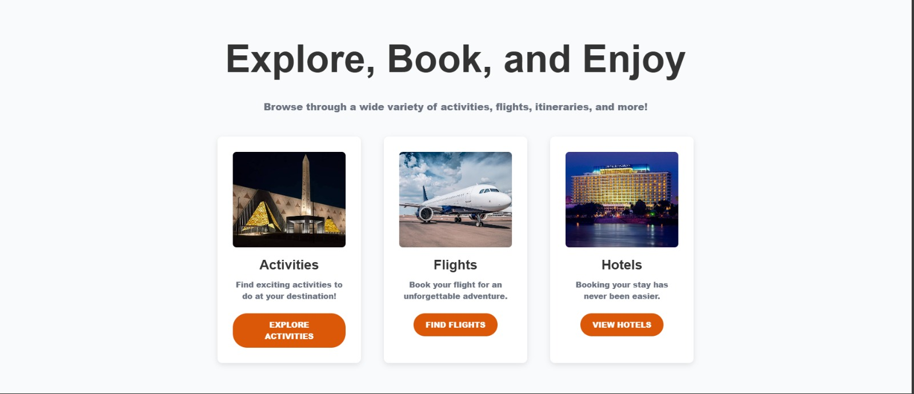
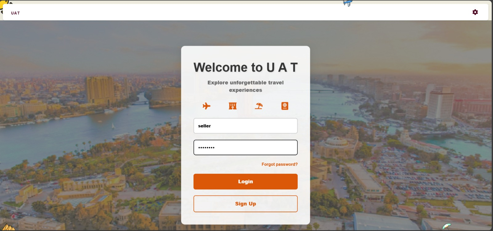
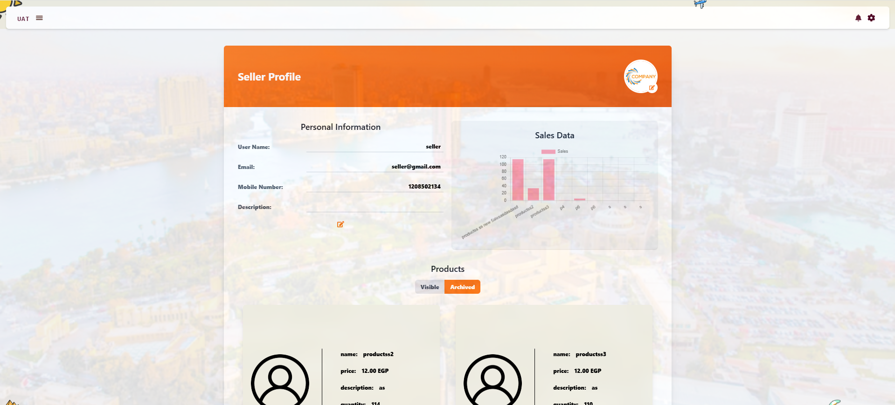
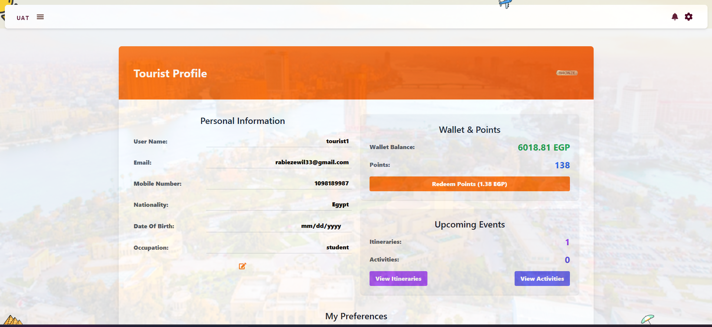
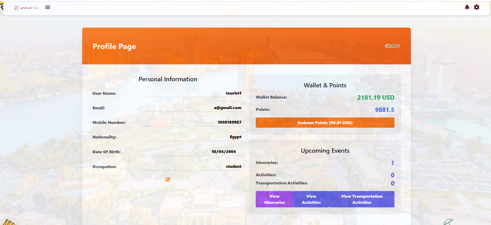
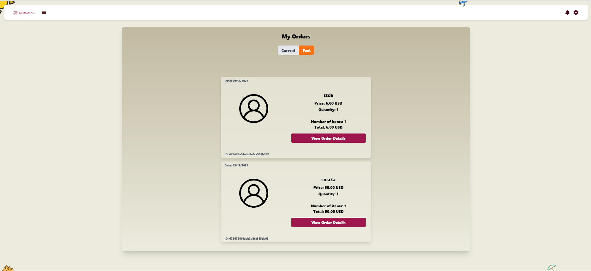
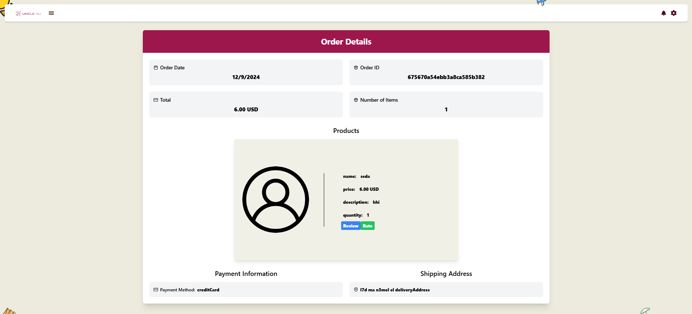
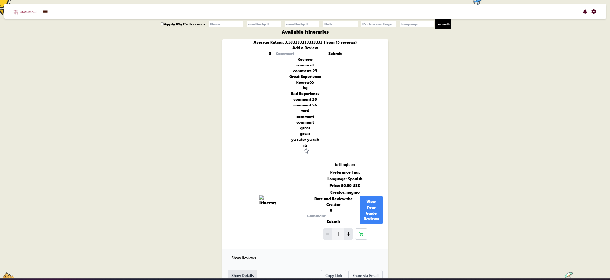
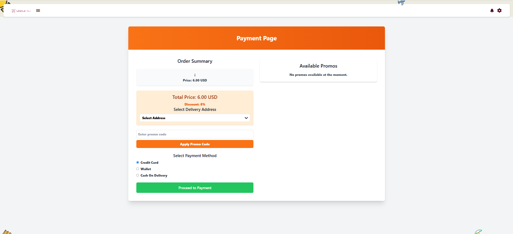
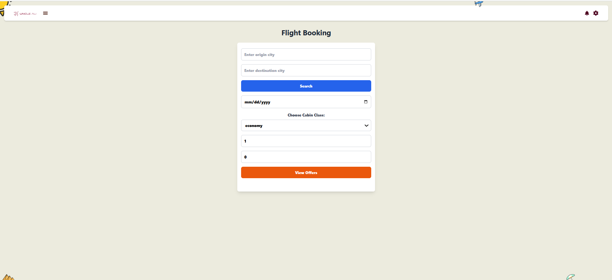
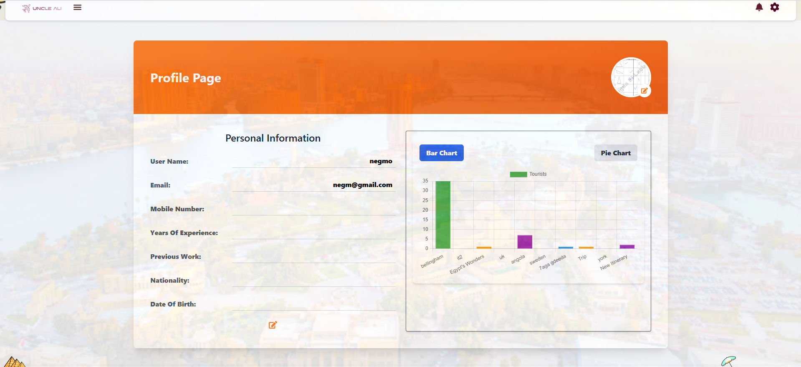
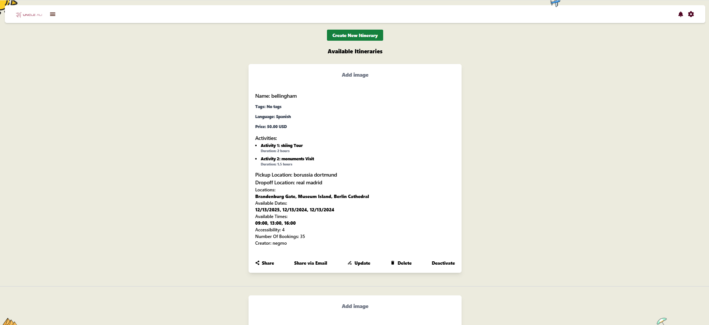
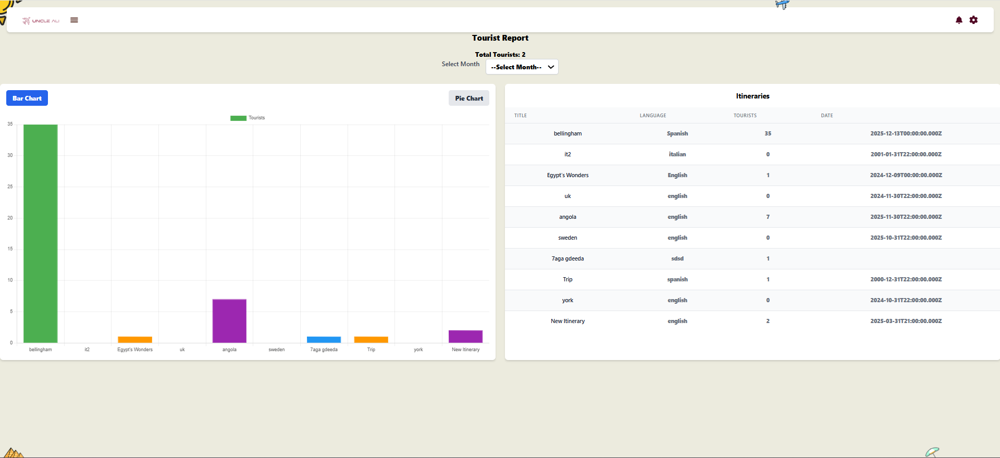
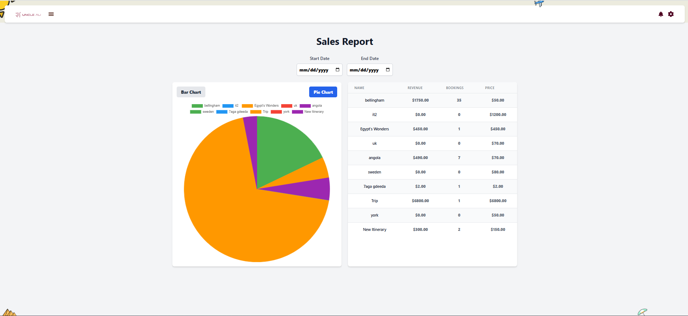
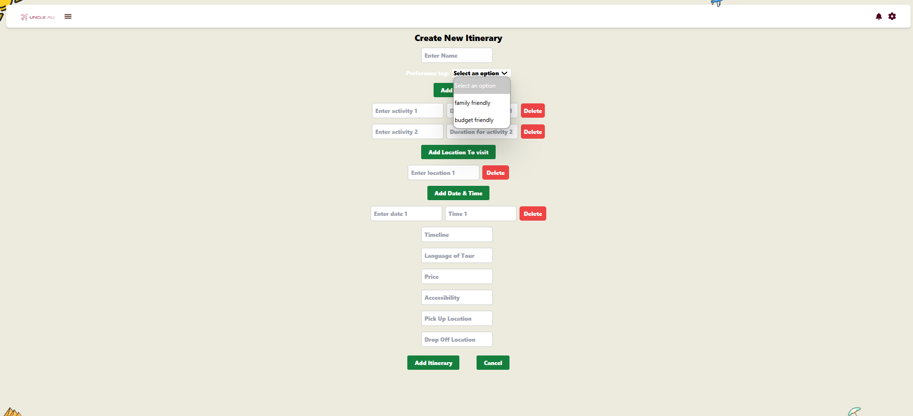
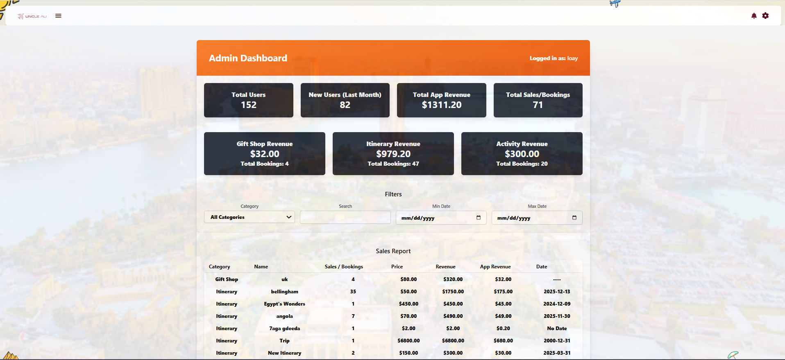
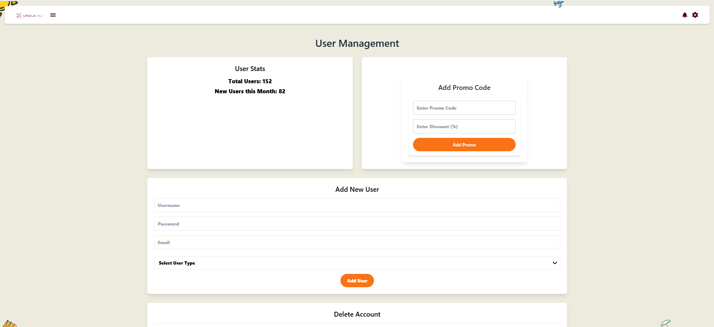
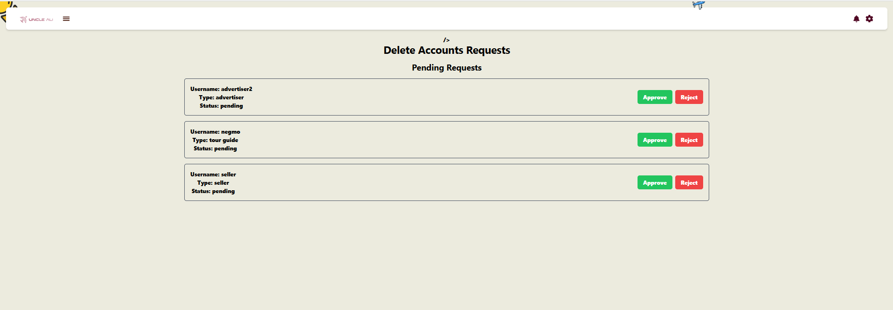
